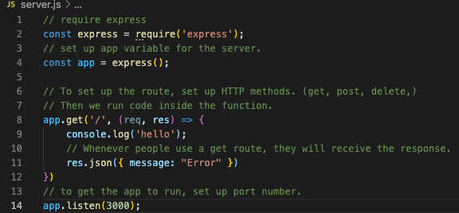

# express-boiler-plate
[](https://opensource.org/licenses/MIT)
* https://www.youtube.com/watch?v=SccSCuHhOw0 || 11:00 (routers)
* run : ```npm init -y``` and ```npm i express```
* ``` npm i --save-dev nodemon ``` and add ```"devStart": "nodemon server.js"``` to scripts.
* running "npm run devStart" will run all code in server.
* Lines 1-13 in server.js set up the basic routing.
* As seen here:
* 
* Below app.get, add ```res.json({ message: "error" })``` and check console to see if there is an error. 
<br>

* to render views, create a views folder with an index.html file inside of it.
* install ejs for your HTML styling: ```npm i ejs```

* in server.js, tell the engine to use ejs by typing ```app.set('view engine', 'ejs')```
* install ejs engine support in VS code.